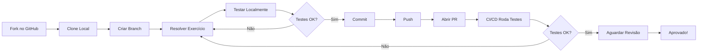

# ⚡ Guia Rápido - Quick Reference

Referência rápida para o sistema de exercícios. Para instruções detalhadas, veja [GUIA-PASSO-A-PASSO.md](./GUIA-PASSO-A-PASSO.md).

---

## 🚀 Workflow Básico em 5 Passos

```bash
# 1️⃣ Atualizar repositório
git checkout main && git pull upstream main

# 2️⃣ Criar branch para o exercício
git checkout -b exercicio-XX

# 3️⃣ Resolver o exercício e testar
npm test -- exXX

# 4️⃣ Commit e push
git add . && git commit -m "feat: resolver exercício XX"
git push origin exercicio-XX

# 5️⃣ Abrir Pull Request no GitHub
# (Acesse seu repositório no navegador)
```

---

## 📋 Comandos Essenciais

### Setup Inicial (fazer uma vez)

```bash
# Clonar seu fork
git clone https://github.com/SEU-USUARIO/backend-frameworks-uninassau-2026-exercicios.git
cd backend-frameworks-uninassau-2026-exercicios

# Instalar dependências
npm install

# Adicionar upstream (repositório original)
git remote add upstream https://github.com/UNINASSAU/backend-frameworks-uninassau-2026-exercicios.git
```

### Comandos Git Frequentes

```bash
# Ver status dos arquivos
git status

# Ver branches locais
git branch

# Criar e mudar para nova branch
git checkout -b nome-da-branch

# Mudar de branch
git checkout nome-da-branch

# Atualizar do upstream
git fetch upstream
git merge upstream/main

# Adicionar arquivos
git add .                              # Todos os arquivos
git add exercicios/ex01/exercicio.js   # Arquivo específico

# Fazer commit
git commit -m "mensagem descritiva"

# Enviar para GitHub
git push origin nome-da-branch

# Ver histórico de commits
git log --oneline

# Descartar mudanças não commitadas
git checkout -- arquivo.js             # Arquivo específico
git reset --hard HEAD                  # Todos os arquivos
```

### Comandos de Teste

```bash
# Rodar todos os testes
npm test

# Rodar teste de exercício específico
npm test -- ex01

# Rodar testes em modo watch (auto-reload)
npm test -- --watch

# Rodar apenas testes que falharam
npm test -- --onlyFailures

# Rodar com cobertura de código
npm test -- --coverage

# Parar execução ao primeiro erro
npm test -- --bail
```

### Comandos npm Úteis

```bash
# Verificar versão do Node.js
node --version

# Verificar versão do npm
npm --version

# Limpar cache
npm cache clean --force

# Reinstalar dependências
rm -rf node_modules package-lock.json
npm install

# Ver dependências instaladas
npm list

# Atualizar dependências
npm update
```

---

## 🎯 Atalhos Úteis

### Git Aliases (adicionar ao ~/.gitconfig)

```bash
# Configurar aliases
git config --global alias.st status
git config --global alias.co checkout
git config --global alias.br branch
git config --global alias.cm commit
git config --global alias.lg "log --oneline --graph --all"

# Usar:
git st      # = git status
git co main # = git checkout main
git cm -m "mensagem" # = git commit -m "mensagem"
git lg      # = git log formatado
```

### Scripts package.json Customizados

Adicione no `package.json` (se não estiverem):

```json
{
  "scripts": {
    "test": "jest",
    "test:watch": "jest --watch",
    "test:coverage": "jest --coverage",
    "test:ex": "jest",
    "lint": "eslint .",
    "lint:fix": "eslint . --fix"
  }
}
```

Usar:
```bash
npm run test:watch
npm run lint:fix
```

### VS Code - Snippets Úteis

Criar arquivo `.vscode/javascript.json`:

```json
{
  "Function Template": {
    "prefix": "func",
    "body": [
      "function ${1:functionName}(${2:params}) {",
      "  ${3:// TODO: implementar}",
      "  return ${4:result};",
      "}",
      "",
      "module.exports = { ${1:functionName} };"
    ]
  },
  "Console Log": {
    "prefix": "clg",
    "body": "console.log('${1:label}:', ${2:variable});"
  }
}
```

---

## 🔍 Cheat Sheet - Resolução de Problemas

| Problema | Solução Rápida |
|----------|----------------|
| Testes não rodam | `rm -rf node_modules && npm install` |
| "jest not found" | `npm install --save-dev jest` |
| Branch desatualizada | `git fetch upstream && git merge upstream/main` |
| Esqueci de criar branch | `git checkout -b exercicio-XX` (cria a partir de onde você está) |
| Conflito de merge | Editar arquivo, remover `<<<<<<<`, `=======`, `>>>>>>>`, depois `git add . && git commit` |
| Descartar mudanças | `git checkout -- arquivo.js` ou `git reset --hard HEAD` |
| Git pede senha sempre | Configurar SSH: veja [Guia Passo a Passo - Problema 3](./GUIA-PASSO-A-PASSO.md#problema-3-git-push-pede-senha-o-tempo-todo) |
| PR com checks falhando | Ver "Details" no GitHub, corrigir código, commit, push (atualiza automaticamente) |

---

## 📝 Templates Rápidos

### Template de Commit

```bash
# Padrão: <tipo>: <descrição>

git commit -m "feat: implementar função X"
git commit -m "fix: corrigir validação de entrada"
git commit -m "refactor: simplificar lógica"
git commit -m "docs: atualizar README"
git commit -m "test: adicionar casos de teste"
```

### Template de Pull Request

```markdown
## Exercício Resolvido
- [x] Exercício XX: [nome do exercício]

## Checklist
- [x] Todos os testes passando localmente
- [x] Código limpo e comentado
- [x] Segui as convenções do projeto

## Observações
(Adicione dúvidas, comentários ou explicações)
```

---

## 🎓 Estrutura do Projeto

```
backend-frameworks-uninassau-2026-exercicios/
├── exercicios/
│   ├── ex01/
│   │   ├── README.md          ← Instruções do exercício
│   │   ├── exercicio.js       ← SEU CÓDIGO AQUI
│   │   └── exercicio.test.js  ← Testes (NÃO MODIFICAR)
│   ├── ex02/
│   └── ...
├── .github/
│   └── workflows/             ← CI/CD (não mexer)
├── node_modules/              ← Dependências (ignorado pelo Git)
├── package.json               ← Configuração do projeto
├── .gitignore                 ← Arquivos ignorados
├── README.md                  ← Documentação principal
├── GUIA-PASSO-A-PASSO.md     ← Guia detalhado
└── GUIA-RAPIDO.md            ← Este arquivo
```

---

## 💡 Dicas Pro

### 1. Testar enquanto desenvolve
```bash
# Terminal 1: Rodar testes em watch mode
npm test -- --watch

# Terminal 2: Editar código
code .
```

### 2. Ver apenas testes que falharam
```bash
npm test -- --verbose
```

### 3. Debug de testes
```javascript
// No seu exercicio.js
function minhaFuncao(param) {
  console.log('DEBUG - param:', param); // Adicionar logs
  const resultado = /* sua lógica */;
  console.log('DEBUG - resultado:', resultado);
  return resultado;
}
```

### 4. Atualizar fork automaticamente
Criar um alias:
```bash
# Adicionar ao ~/.bashrc ou ~/.zshrc
alias git-sync='git checkout main && git fetch upstream && git merge upstream/main && git push origin main'

# Usar:
git-sync
```

### 5. Ver diferenças antes de commitar
```bash
git diff                    # Ver mudanças não staged
git diff --staged          # Ver mudanças staged
git diff HEAD              # Ver todas as mudanças
```

---

## 🔗 Links Úteis

| Recurso | URL |
|---------|-----|
| Node.js Docs | https://nodejs.org/docs |
| Git Docs | https://git-scm.com/doc |
| GitHub Guides | https://guides.github.com |
| Jest Docs | https://jestjs.io/docs |
| VS Code | https://code.visualstudio.com |
| Markdown Guide | https://www.markdownguide.org |

---

## 🆘 Quando Pedir Ajuda

**Antes de pedir ajuda:**
1. ✅ Leu a mensagem de erro completa?
2. ✅ Verificou a seção de Troubleshooting?
3. ✅ Pesquisou no Google/Stack Overflow?
4. ✅ Tentou pelo menos 3 abordagens diferentes?

**Como pedir ajuda efetivamente:**
```markdown
**Problema:** [Descrição clara do que está acontecendo]

**O que eu tentei:**
1. [Primeira tentativa]
2. [Segunda tentativa]
3. [Terceira tentativa]

**Mensagem de erro:**
```
[Cole a mensagem de erro completa aqui]
```

**Código relevante:**
```javascript
[Cole o trecho de código relacionado]
```

**Ambiente:**
- Node.js: v20.x.x
- OS: Windows/Mac/Linux
- Exercício: ex01
```

---

## 📊 Status dos Checks

Interpretar status do Pull Request:

| Símbolo | Status | Significado |
|---------|--------|-------------|
| ✅ | Passed | Todos os testes passaram! |
| ❌ | Failed | Alguns testes falharam |
| 🟡 | Pending | Testes ainda rodando |
| ⚪ | Skipped | Testes não foram executados |

**Ver detalhes:**
1. Clicar em "Details" no check
2. Ler os logs de erro
3. Corrigir localmente
4. Commit + Push (atualiza automaticamente)

---

## 🎯 Fluxo Completo Resumido



---

## ⚙️ Configurações Recomendadas

### Git (adicionar ao ~/.gitconfig)

```ini
[user]
    name = Seu Nome
    email = [email protected]

[core]
    editor = code --wait
    autocrlf = input  # Linux/Mac
    # autocrlf = true  # Windows

[alias]
    st = status
    co = checkout
    br = branch
    cm = commit
    lg = log --oneline --graph --all
    unstage = reset HEAD --
    last = log -1 HEAD

[pull]
    rebase = false

[init]
    defaultBranch = main
```

### VS Code (settings.json)

```json
{
  "editor.formatOnSave": true,
  "editor.tabSize": 2,
  "editor.insertSpaces": true,
  "files.trimTrailingWhitespace": true,
  "files.insertFinalNewline": true,
  "javascript.suggest.autoImports": true,
  "javascript.updateImportsOnFileMove.enabled": "always"
}
```

---

## 🏆 Boas Práticas - Checklist Rápido

Antes de fazer Push:
- [ ] Código implementado e funcionando
- [ ] Todos os testes passando (`npm test -- exXX`)
- [ ] Código limpo (sem console.logs de debug)
- [ ] Commit com mensagem descritiva
- [ ] Branch com nome correto (`exercicio-XX`)

Antes de abrir PR:
- [ ] Fork atualizado com upstream
- [ ] Testado localmente
- [ ] Título do PR claro
- [ ] Descrição preenchida
- [ ] Checklist marcado

---

**🚀 Pronto para começar! Qualquer dúvida, consulte o [GUIA-PASSO-A-PASSO.md](./GUIA-PASSO-A-PASSO.md)**
